# Database and sql task:

To summarize what I have learned in the sql introduction I will start with the things I didnt know for example I have never used the between and I also didnt use join before and the idea of group by was unfamilier to me . but I found out that i will need more practice on the sql part .

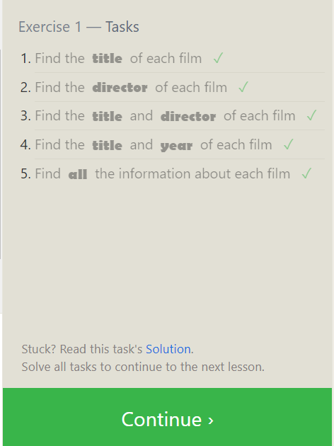
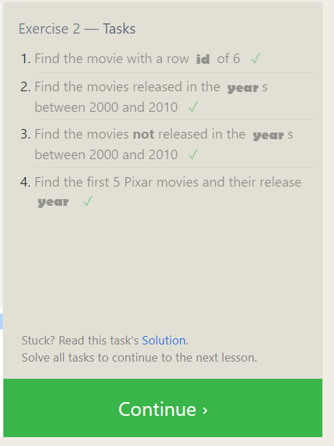
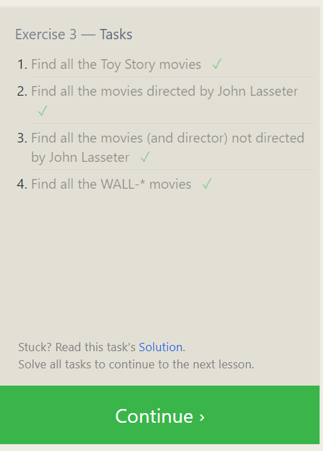
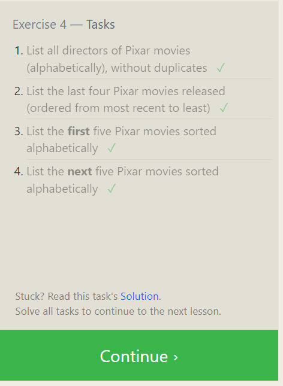
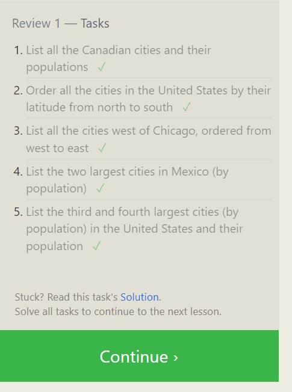
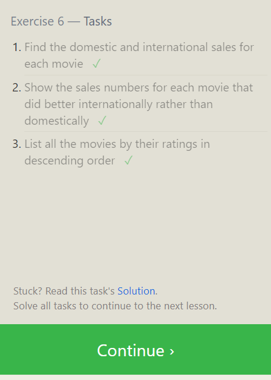
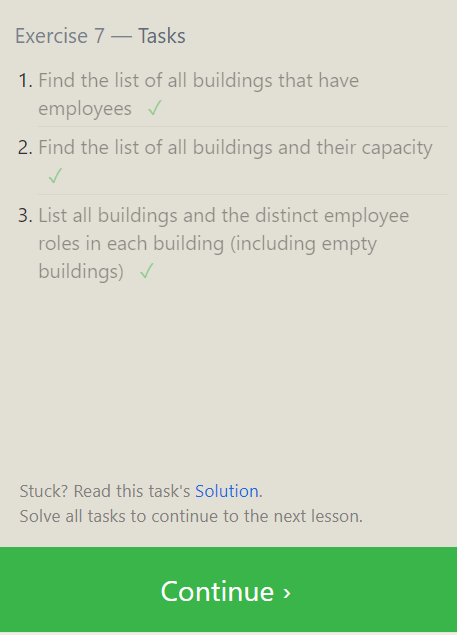
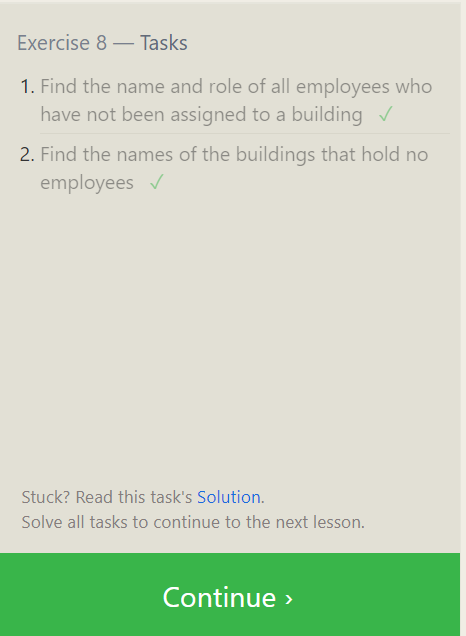
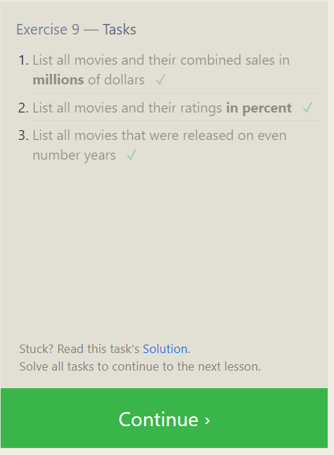
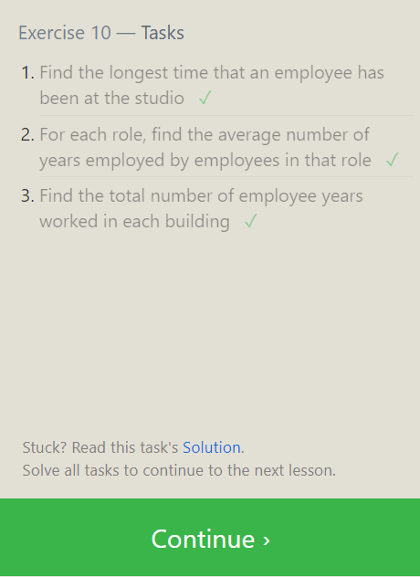
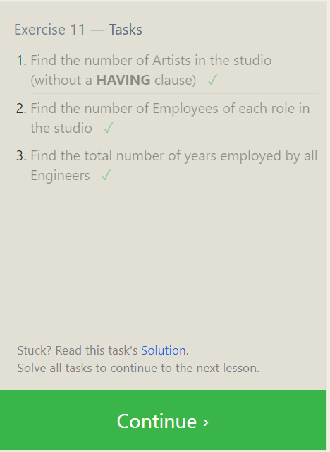
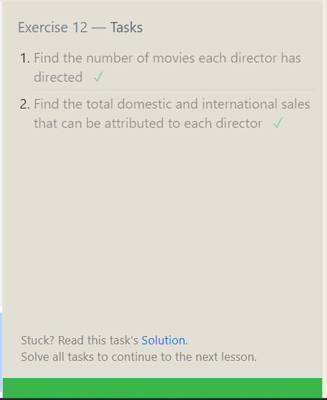
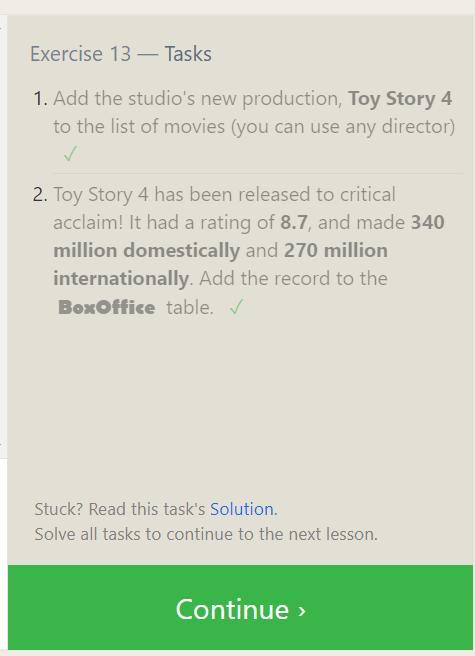
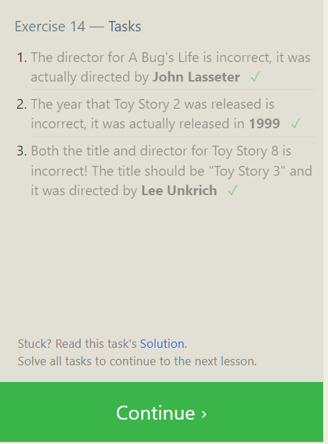
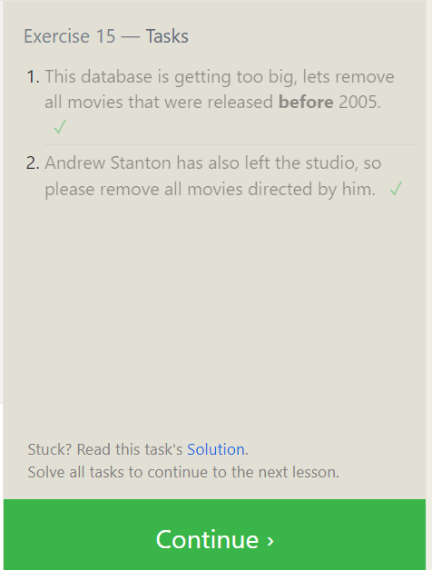
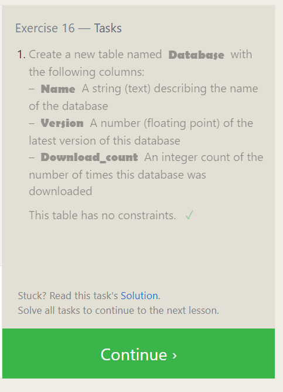
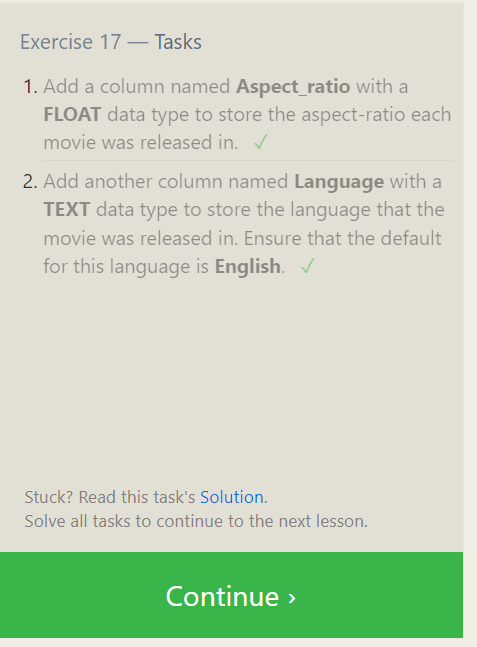
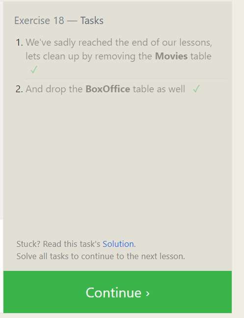